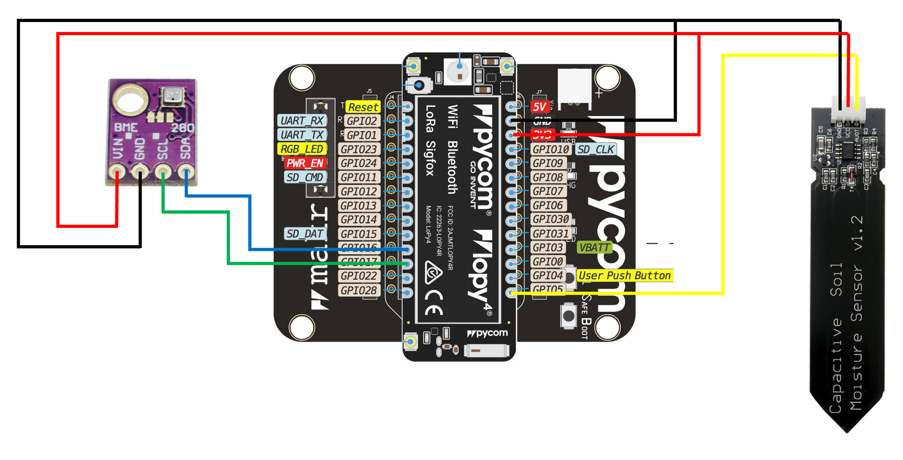

# Building a Greenhouse monitoring sensor

###### tags: `MicroPython` `IoT` `LoRaWAN` `TTN` `Home Assistant`
#### Author: Jonas Andersson
#### Course: Applied IoT, 4DV119 (Expertkompetens IoT), Linneus University, 2022

---
**Table of Contents**

- [Project Overview](#project-overview)
- [Project Objective](#project-objective)
- [Material](#material)
- [Environment Setup](#environment-setup)
- [Putting everything together](#putting-everything-together)

### Project Overview
This tutorial will explain how to build and program the behavior of a device with sensors measuring air temperature, humidity and soil moisture.
I will explain how I built the device and what tools I used.
This is a project in the course 4DV119 (Expertkompetens IoT) at Linnaeus University of Kalmar and Växjö.

### Project Objectives
I chose this project to learn more about MicroPython. I have tested it before but never really done anything useful with it. I was also interested in using LoRaWAN as a communication protocol and see if I could show the data in my Home Assistant installation at home.
I decided to make a Greenhouse sensor for surveillance of the temperature and the moisture in the soil. If it gets to hot in the summer, we will have to open the doors to evacuate some of the heat and if the soil gets to dry, we need to water the plants (of course). Knowing the status by looking in a mobile app or getting a notification when some limit values are reached is appealing for me and the mrs.

### Material

>| Component |Cost |Store | Function         |
>| --------- | ---- | ------------------------- | --------------------------------------|
>| Pycom Lopy4 | 38€ | https://www.digikey.se/ | Microcontroller with MicroPython environment|
>| Pycom Expansion board | 17€ | https://www.digikey.se/ | For connecting things |
>| Mini breadboard | 3€ | https://www.electrokit.com/ | For connecting more things |
>| BME280 | 7€ | https://www.amazon.se/ | Sensor with air-temperature, humidity and pressure sensor. Communicates over I2C-bus|
>| Capacitive Soil Moisture Sensor | 7€ | https://www.amazon.se/ | For measuring soil moisture. Analog signal. Needs calibrating! |
>| LiPo Battery 3,7V 2200mAh | 10€ | https://www.electrokit.com/ | Lithium battery with JST PH 2.0mm connector |

### Environment setup

I used Microsoft Visual Studio Code as my code editor. It is free and available for Windows, Mac OS and Linux. You can download it here:
https://code.visualstudio.com/

PyMakr extension is good for managing the Pycom microcontroller. You can find it in VS Code Extension library. Just klick “Install”. 
For more information visit:
https://docs.pycom.io/gettingstarted/software/vscode/

I also used Pycom Firmeware updater to update the firmware of my LoPy4.
https://docs.pycom.io/updatefirmware/

### Putting everything together
*work in progress*

### Platforms and infrastructure
*work in progress*

### The code
*work in progress*

### The physical network layer
*work in progress*

### Visualisation and user interface
*work in progress*

### Finalizing the design
*work in progress*

---