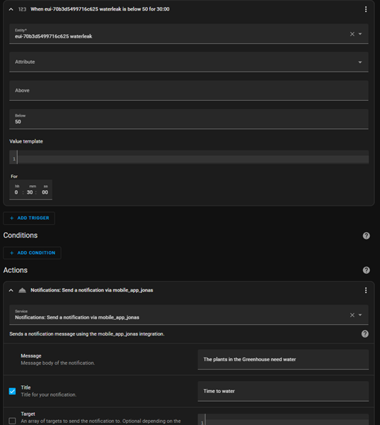
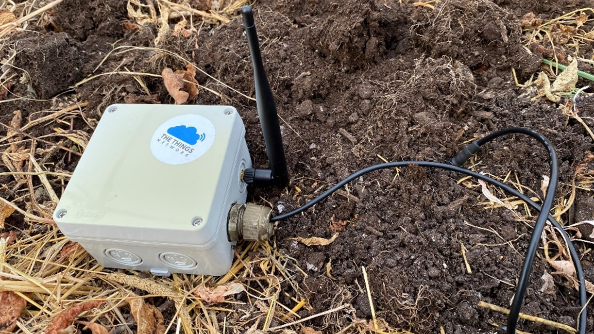
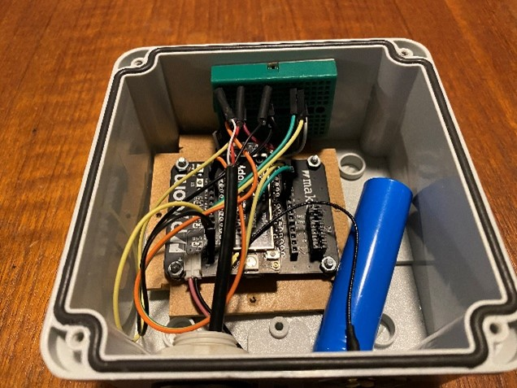
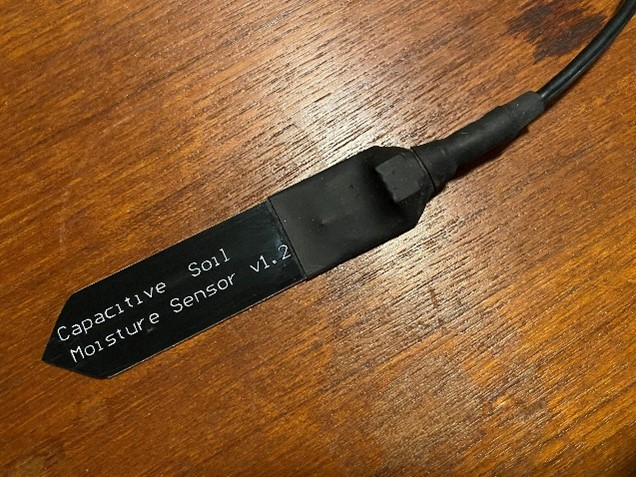

# Building a Greenhouse monitoring sensor

###### tags: `MicroPython` `IoT` `LoRaWAN` `TTN` `Home Assistant`
#### Author: Jonas Andersson
#### Course: Applied Internet of Things (Professional Education), 4DV119, Linneus University, 2022
#### Approximate time consumption to finish with tutorial: 3-5 hours

---
**Table of Contents**

- [Project Overview](#project-overview)
- [Project Objective](#project-objective)
- [Material](#material)
- [Environment Setup](#environment-setup)
- [Putting everything together](#putting-everything-together)
- [Circuit diagram](#circuit-diagram)
- [Power consumption](#power-consumption)
- [Platforms and infrastructure](#platforms-and-infrastructure)
- [The code](#the-code)
- [Calibrating the moisture sensor](#calibrating-the-moisture-sensor)
- [The data model](#the-data-model)
- [The physical network layer](#the-physical-network-layer)
- [Visualisation and user interface](#visualisation-and-user-interface)
- [Finalizing the design](#finalizing-the-design)

### Project Overview
This tutorial will explain how to build and program the behavior of a device with sensors measuring air temperature, humidity, and soil moisture.
I will explain how I built the device and what tools I used.
This is a project in the course Applied Internet of Things (Professional Education) 4DV119 at Linnaeus University of Kalmar and Växjö.


### Project Objectives
I chose this project to learn more about MicroPython. I have tested it before but never really done anything useful with it. I was also interested in using LoRaWAN as a communication protocol and see if I could integrate with my Home Assistant installation at home.
I decided to make a Greenhouse sensor for monitoring of the temperature and humidity in the air and the moisture in the soil. If it gets to hot in the summer, we will have to open the doors to evacuate some of the heat and if the soil gets to dry, we need to water the plants (of course). Knowing the status by looking in a mobile app or getting a notification when some limit values are reached is appealing for me and the missus.


### Material

>| Component |Cost |Store | Function         |
>| --------- | ---- | ------------------------- | --------------------------------------|
>| Pycom Lopy4 | 38€ | https://www.digikey.se/ | Microcontroller with MicroPython environment|
>| Pycom Expansion board | 17€ | https://www.digikey.se/ | For connecting things |
>| Mini breadboard | 3€ | https://www.electrokit.com/ | For connecting more things |
>| BME280 | 7€ | https://www.amazon.se/ | Sensor with air-temperature, humidity and pressure sensor. Communicates over I2C-bus|
>| Capacitive Soil Moisture Sensor | 7€ | https://www.amazon.se/ | For measuring soil moisture. Analog signal. Needs calibrating! |
>| LiPo Battery 3,7V 2200mAh | 10€ | https://www.electrokit.com/ | Lithium battery with JST PH 2.0mm connector |
>| Old USB cable | ?€ | My drawer | For connecting the Soil Moisture Sensor |


### Environment setup

I used Microsoft Visual Studio Code as my code editor. It is free and available for Windows, Mac OS and Linux. You can download it here:
https://code.visualstudio.com/

Before you install PyMakr you will probably need to install NodeJS on your computer. I recommend you download the latest LTS version available from the NodeJS website.
https://nodejs.org/

The PyMakr extension is good for managing the Pycom microcontroller (LoPy) and upload your code to the device. You can find it in the Extension library in VS Code. Just klick “Install”, and VS Code will download and install it. 
For more information visit:
https://docs.pycom.io/gettingstarted/software/vscode/

When PyMakr is installed, you will get a new app on the left-hand side of your VS Code window containing a Project and a Device section. In the project section you should create a new project and add your device (Pycom connected via USB) to that project. This will allow you to establish a terminal session over the USB where you can write commands directly in the device and upload python files (.py) which can be executed by the Pycom. The default python file is named main.py There is also a boot.py where commands end start parameters can be entered. I didn’t need to put anything in boot.py in my project.
To be able to use certain sensors or special functions you will sometimes need to download libraries containing Python code someone else has created. I placed these libraries in a folder named lib. You can then include these files with the import function. In this project needed the library BME280 to be able to use the BME280 sensor.
I also used Pycom Firmware updater to update the firmware of my LoPy4, you probably don’t need it and I had some problems with the upgrade (my Lopy4 was identified as a Lopy1). 
If you still want to try:
https://docs.pycom.io/updatefirmware/


### Putting everything together

#### Circuit diagram
Here is a circuit diagram explaining how I connected the sensors. These sensors are easy to connect, and you don’t need any pull-up resistors or anything like that. The Moisture sensor can be connected to any GPIO port, but the BME 280 must be connected to GPIO ports that has I2C capability.
I used a mini breadboard to make it easier to connect all the components as you can see in the pictures below. This setup works for evaluation of the setup but for a more robust production solution I would need to solder the connections and perhaps loose the expansion board to save some battery.


Fig 1. Circuit diagram

#### Power consumption
The electrical power consumption from the specifications from the manufacturer.
Part		Current
BME280 I2C		1mA, 5μA idle
Capacitive Soil Sensor	5mA, idle not specified 
Pycom Lopy4		108mA Transmitting, 35,4mA Idle, 18µA deep sleep
Pycom Expansion Board	30mA ?


### Platforms and infrastructure

As soon as I choose my project, I identified a challenge with connectivity. My Wi-Fi and Z-wave networks in the house was to far away. Mobile connectivity was a possibility, but the cost was too much for my taste. I have worked with LoRaWAN before, so the choice was easy.
I started with a Heltec LoRa enabled device with a small display. It looked nice and the display was a nice bonus. Unfortunately, the display broke after a week and when I was trying to disconnect the antenna the PCB connector broke! Back to the drawing board!
A Pycom LoPy4 with a nice Expansion board was my backup plan and it turned out to work really well.

I choose Home Assistant since this is the platform, I use form my home automation. I think this is an interesting platform since it has many ways of integrating with IoT devices and other platforms and probably is the fastest growing platform for home automation right now. I have tried OpenHab and Domoticz at home and had the opportunity to work with commercial platforms like Yggio, IoT Open and Thingsboard at work, but none of them has the community support like Home Assistant.
I use a Raspberry Pi 4 with 8GB of RAM and an SSD disk connected via USB. I can recommend using that setup since a Raspberry Pi is not that expensive and an SSD is more robust than a SD card that you normally use in a Raspberry Pi. I have worn out quite a few SD cards over the years! 

I already had a Things Network gateway at home so that decision was simple. The Things Network Community Edition is a cloud service that allows you to manage LoRaWAN gateways and devices with their Things Stack platform. They allow you to setup a temporary storage for your data and has several integrations with other platforms that is better suited for analysis and visualization. Setting up an integration with my Home Assistant at home was smooth and didn’t produce any problems. I used this integration:
https://github.com/angelnu/home_assistant_thethingsnetwork

A nice thought thou would be to have my own LoRaWAN network server at home. Perhaps even on the same Raspberry Pi that I run home assistant on!
I had a look at Chirpstack, and I think it look interesting. The problem is that I need more time to test this and the course at the university is time limited. I will come back to this another time. Everything else in my home automation is non-cloud and I like to keep it like that.


### The code
A brief explanation of the code is that it reads the sensor values sends them over LoRaWAN and goes to sleep for half an hour and then repeats the process.

I use lora.nvram to store the LoRaWAN state to avoid doing a Join everytime it wakes up. It saves radio transmission time and battery.
I use I2C and ADC libraries to communicate with the sensors and a downloaded library to be able to interpret the data from the BME280 sensor. 
I read and used this guide to get started with the BME280:
https://randomnerdtutorials.com/micropython-bme280-esp32-esp8266/

#### Calibrating the moisture sensor
The moisture sensor needs to be calibrated and I found this example:
https://stackoverflow.com/questions/64744090/how-to-convert-the-adc-output-of-the-capacitive-soil-humidity-sensor-v1-2-to-act

After experimenting a bit, I took the easy way and registered the values for the sensor when I held it in the air, not touching anything and then I registered values with the sensor in a glass of water. In my case these values where 1230 and 3450. I map these values to 100 and 1 to get a percentage value that is easier to understand with this function:


```
def remap(value, leftMin, leftMax, rightMin, rightMax):
    leftSpan = leftMax - leftMin
    rightSpan = rightMax - rightMin
    valueScaled = float(value - leftMin) / float(leftSpan)
    return rightMin + (valueScaled * rightSpan)
```

And then I call on the function like this:
```
moist_float = remap(adcpin(), 1230, 3450, 100, 1)
```

#### The data model
I have worked a little bit with LoRaWAN devices before and I knew there wasn’t a standardized way of structuring the payload containing my sensor data. I have worked with devices manufactured by a Swedish company named Elsys and I knew they had a simple but solid payload encoding. And they published code examples on their web site! Nice!
https://www.elsys.se/en/elsys-payload/
In The Things Stack I use the Payload formatter and the code from Elsys to make a translator for the payload transmitted over LoRaWAN. They have a nice test feature where you can test that the translator works as it should. Nice way of learning as well!


Fig 2. The Things Stack Payload formatter

I know it isn’t a hard thing to invent translator yourself but if I would want to send the data to another platform, I know that Elsys devices are common and there is often a built-in payload decoder for them. I also looked at Cayenne LPP decoder, but the Elsys had more built-in data types to choose from.
https://docs.mydevices.com/docs/lorawan/cayenne-lpp

The data types I’m using in my code:

```
type_temp = 0x01      # Temperature
type_rh = 0x02        # Relative Humidity
type_pressure = 0x14  # Air pressure
type_waterleak = 0x12 # Soil Moisture (The real name is waterleak and I should perhaps rename this…)
type_vdd = 0x07       # Battery voltage
```

I use struct to translate the data to the right format according to Elsys decoder when I’m sending over LoRaWAN.
https://docs.python.org/3/library/struct.html

```
s.send(struct.pack('!bHbBbLbB', type_temp, temp, type_rh, hum, type_pressure, pres, type_waterleak, moist))
```


### The physical network layer
LoRaWAN is a network protocol that is transported with radio modulation called LoRa.
LoRa is designed to communicate long distances without having to increase the radio output gain. It is capable of get messages through even if there is interference. A disadvantage with LoRaWAN is that the regulations in Europe limits how long devices using 868MHz can send. It’s called “1% duty cycle” and means that if you for example send for one second you need to be quiet for 99 seconds.
The radio chip used for LoRa is a little bit more expensive than for example a Wi-Fi chip, since there is a license fee for manufacturing them.


### Visualisation and user interface
I used Home Assistant for visualization and notification when a limit I reached. I chose this platform because all my other automation in and around my house is handled in that platform. The data is stored in an SQLite database and is purged after 10 days. This is the default setting for Home Assistant and is good for now, but it would be nice to have long term storage as well. 


Fig 3. Home Assistant dashboard

For sending notification to my smartphone, I used the automation rule set in Home Assistant. With this tool it is easy to set triggers for when an event is going to happen. There is also the possibility of installing Node Red as a plugin for Home Assistant. This can be even more powerful and is often easy for beginners to use since it is more drag-and-drop than writing.


Fig 4. Home Assistant automation

### Finalizing the design
This was a fun project. I learned a lot about MicroPython even if I only scratched the surface. There is much more to learn and I’m lucking forward to it. 
I’m thinking of developing this further by controlling the irrigation with data from the moisture sensor. A senor for measuring the temperature in the soil would also be nice. In that case I think I would choose a water resistant DS18B20 with attached cable. They are rather cheep but require a pull-up resistor to work. 

Right now, its late fall and winter is coming but when spring comes this will be tested for real!


Fig 5. The device in the casing I chose


Fig 6. The inside of the box


Fig 7. The Moisture sensor with extra protective heat tube

---